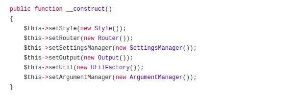

### Design pattern in PHP
- Tìm các design pattern được sử dụng trong package: https://github.com/thephpleague/climate/tree/master/src

## Singleton
- [Logger.php](https://github.com/thephpleague/climate/blob/master/src/Logger.php)

## Abstract Factory
- [Decorator/Parser](https://github.com/thephpleague/climate/tree/master/src/Decorator/Parser)

 + ParserFactory.php

## Facade && Command
- Ở cái file [CLImate.php](https://github.com/thephpleague/climate/blob/master/src/CLImate.php) thấy có áp dụng 2 pattern:
    + Facade:
    
    + Command:
    

